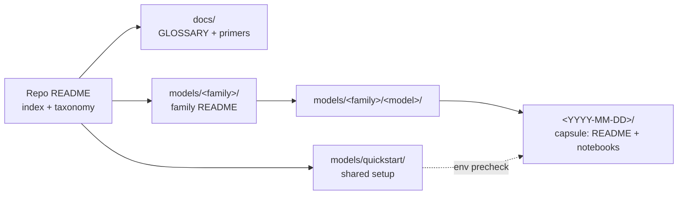

# Microsoft Foundry Model Releases

> **Content capsules for every Foundry model release.** Small, self-contained
> learning units that take you from *"a model dropped"* to *"I've run it and
> I know when to use it"* — fast.

---

## Recent activity

<!-- BEGIN:RECENT-ACTIVITY -->
_No capsules yet. The 3 most recent release capsules show up here as soon
as they're authored._
<!-- END:RECENT-ACTIVITY -->

## Expiring soon

> ⚠️ **Migration heads-up.** Models retiring in the **next 60 days** are
> listed here so developers can start moving to the successor capsule
> before their deployment goes cold.

<!-- BEGIN:EXPIRING-SOON -->
_No models flagged for retirement in the next 60 days._
<!-- END:EXPIRING-SOON -->

Both sections are maintained by the
[`refresh-recent-activity`](.github/skills/refresh-recent-activity/) skill —
run it after adding a capsule, and on a monthly cadence to catch upcoming
expirations.

---

## How this repo is organized

Every capsule lives at `models/<family>/<model>/<YYYY-MM-DD>/` and points
back to the shared quickstart, docs, and glossary.

---

## Start here

1. **[`models/quickstart/`](models/quickstart/)** — set up a Foundry project,
   deploy models, and configure `.env` **once**. Every capsule notebook
   verifies your env before running any code.
2. Browse a family below, pick a release, open its capsule.
3. New to a capability? Read the matching [primer](docs/) first.

---

## Model families

| Family | What it's for | README |
|---|---|---|
| Azure OpenAI | GPT-family models via Foundry | [`models/azure-openai/`](models/azure-openai/) |
| Microsoft AI | Microsoft-built models (Phi, MAI, …) | [`models/microsoft-ai/`](models/microsoft-ai/) |
| Anthropic | Claude family | [`models/anthropic/`](models/anthropic/) |
| Cohere | Command + Embed models | [`models/cohere/`](models/cohere/) |
| Mistral | Mistral / Mixtral / Ministral | [`models/mistral/`](models/mistral/) |
| Model Router | One endpoint, routed to best-fit model | [`models/model-router/`](models/model-router/) |
| Hugging Face | Open-source model catalog | [`models/hugging-face/`](models/hugging-face/) |
| Fireworks | Fast OSS-model inference | [`models/fireworks/`](models/fireworks/) |
| DeepSeek | DeepSeek reasoning + chat models | [`models/deepseek/`](models/deepseek/) |
| xAI | Grok family | [`models/xai/`](models/xai/) |
| Black Forest Labs | FLUX image-generation models | [`models/black-forest-labs/`](models/black-forest-labs/) |

---

## Capability taxonomy

Every capsule is tagged with one or more of these. Names are defined
**once here** and reused everywhere (family READMEs, capsule badges,
CHANGELOG, Recent activity).

| Tag | What it means | Primer |
|---|---|---|
| **Chat Completion** | General instruction-following and dialogue. | [chat-completion](docs/primers/chat-completion.md) |
| **Reasoning** | Extended-thinking / chain-of-thought optimized models. | [reasoning-models](docs/primers/reasoning-models.md) |
| **Multimodal** | Accepts image (and/or audio) input alongside text. | [multimodal-models](docs/primers/multimodal-models.md) |
| **Vision** | Image understanding as a primary capability. | [multimodal-models](docs/primers/multimodal-models.md) |
| **Image Generation** | Text → image output. | [image-generation](docs/primers/image-generation.md) |
| **Embeddings** | Vector representations for retrieval / similarity. | [embeddings](docs/primers/embeddings.md) |
| **Audio / Speech** | STT, TTS, or realtime voice. | [audio-speech](docs/primers/audio-speech.md) |
| **Function Calling** | Structured tool invocation. | [function-calling](docs/primers/function-calling.md) |
| **Model Router** | One endpoint that routes requests across models. | [model-router](docs/primers/model-router.md) |
| **Fine-tuning Ready** | Supports customization / distillation. | [fine-tuning](docs/primers/fine-tuning.md) |
| **Long Context** | 200k+ token context window. | [long-context](docs/primers/long-context.md) |

Unsure what a term means? Check the [glossary](docs/GLOSSARY.md).

---

## Changelog

Every release lands in [`CHANGELOG.md`](CHANGELOG.md) — announcement link,
model card link, and capsule link (if one exists).

---

## Contribute a capsule

Authoring a capsule is agent-driven. Ask GitHub Copilot:

> _"Use the **CapsuleCreatorAgent** to add a capsule for &lt;family&gt; / &lt;model&gt; released on &lt;date&gt;."_

The agent orchestrates these skills under `.github/skills/`:

- [`add-family`](.github/skills/add-family/) — register a new family
- [`add-model`](.github/skills/add-model/) — register a new model under a family
- [`add-capsule`](.github/skills/add-capsule/) — scaffold a release capsule
- [`add-to-glossary`](.github/skills/add-to-glossary/) — define a new term
- [`add-capability-doc`](.github/skills/add-capability-doc/) — add a capability primer
- [`refresh-recent-activity`](.github/skills/refresh-recent-activity/) — update the README section above

The living plan for this repo is in [`.github/plan.md`](.github/plan.md).
Maintainers: start with the [maintainer guide](.github/maintainer-guide.md)
for setup validation, routine tasks, and the testing strategy.
