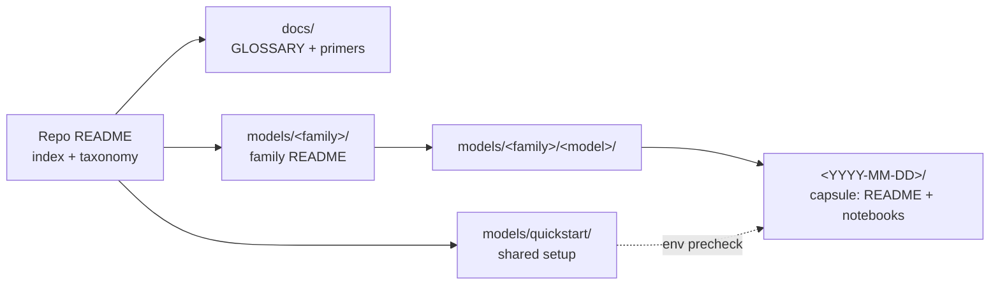
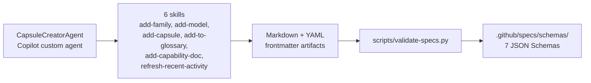

# Microsoft Foundry Model Releases

The [Microsoft Foundry Model Catalog](https://ai.azure.com/catalog) has 11K+ models and continues to grow with new model families and versions being released regularly. This repository supports new releases with _content capsules_ that g

> **Content capsules for every Foundry model release.** Small, self-contained
> learning units that take you from *"a model dropped"* to *"I've run it and
> I know when to use it"* — fast.

---

## Recently added

Recent release announcements, with expiry date and pricing links when
known. Expiry dates are **bolded** when the model retires in the next
60 days — time to look at a successor.

<!-- BEGIN:RECENTLY-ADDED -->
| Release date | Model | Description | Expires |
|---|---|---|---|
| [2026-07-29](https://techcommunity.microsoft.com/blog/azure-ai-foundry-blog/introducing-gpt-transcribe-and-gpt-live-transcribe-in-microsoft-foundry/4541740) | **GPT-transcribe** | Async speech-to-text, high accuracy, Azure OpenAI | — |
| [2026-07-29](https://techcommunity.microsoft.com/blog/azure-ai-foundry-blog/introducing-gpt-transcribe-and-gpt-live-transcribe-in-microsoft-foundry/4541740) | **GPT-live-transcribe** | Low-latency streaming ASR via the Realtime API | — |
| [2026-07-28](https://techcommunity.microsoft.com/blog/azure-ai-foundry-blog/introducing-kimi-k3-through-fireworks-ai-on-microsoft-foundry/4540187) | **Kimi K3** | Open-weight, 2.8T params, 1M-token context — via Fireworks AI | — |

_Top 3 most recent — see [`CHANGELOG.md`](CHANGELOG.md) for the full history and pricing._
<!-- END:RECENTLY-ADDED -->

---

## How this repo is organized

Think of the repo as a set of nested folders that get more specific as
you go deeper — each layer exists so you don't have to re-learn the
things above it.

- **`docs/`** is where we keep the shared vocabulary — a glossary and
  short primers on capabilities like "reasoning" or "function calling"
  — so a capsule can say "this model does X" without re-explaining X
  every time.
- **`models/quickstart/`** is the one place you set up Foundry, deploy
  a model, and drop your keys into `.env`. Every capsule notebook runs
  a quick env check first, so if quickstart is done, everything else
  just works.
- **`models/<family>/`** groups models by who ships them (Azure OpenAI,
  Anthropic, Mistral, …). Family READMEs cover the stuff that's true
  for every model in the family — auth, deployment quirks, common
  gotchas — so individual capsules can stay focused on what's new.
- **`models/<family>/<model>/`** is the home for a specific model
  across its lifetime. Capabilities and quirks that persist across
  releases live here.
- **`models/<family>/<model>/<YYYY-MM-DD>/`** is a **capsule**: a
  single, self-contained lesson about one release on the date it
  landed. That's why the date is in the path — you can come back a
  year later and still know exactly which version you learned against.

---

## Start here

1. **[`models/quickstart/`](models/quickstart/)** — set up a Foundry project,
   deploy models, and configure `.env` **once**. Every capsule notebook
   verifies your env before running any code.
2. Browse a family below, pick a release, open its capsule.
3. New to a capability? Read the matching [primer](docs/) first.

---

## Model families

| Family | What it's for | README |
|---|---|---|
| Azure OpenAI | GPT-family models via Foundry | [`models/azure-openai/`](models/azure-openai/) |
| Microsoft AI | Microsoft-built models (Phi, MAI, …) | [`models/microsoft-ai/`](models/microsoft-ai/) |
| Anthropic | Claude family | [`models/anthropic/`](models/anthropic/) |
| Cohere | Command + Embed models | [`models/cohere/`](models/cohere/) |
| Mistral | Mistral / Mixtral / Ministral | [`models/mistral/`](models/mistral/) |
| Model Router | One endpoint, routed to best-fit model | [`models/model-router/`](models/model-router/) |
| Hugging Face | Open-source model catalog | [`models/hugging-face/`](models/hugging-face/) |
| Fireworks | Fast OSS-model inference | [`models/fireworks/`](models/fireworks/) |
| DeepSeek | DeepSeek reasoning + chat models | [`models/deepseek/`](models/deepseek/) |
| xAI | Grok family | [`models/xai/`](models/xai/) |
| Black Forest Labs | FLUX image-generation models | [`models/black-forest-labs/`](models/black-forest-labs/) |

---

## Capability taxonomy

Every capsule is tagged with one or more of these. Names are defined
**once here** and reused everywhere (family READMEs, capsule badges,
CHANGELOG, Recently added).

| Tag | What it means | Primer |
|---|---|---|
| **Chat Completion** | General instruction-following and dialogue. | [chat-completion](docs/primers/chat-completion.md) |
| **Reasoning** | Extended-thinking / chain-of-thought optimized models. | [reasoning-models](docs/primers/reasoning-models.md) |
| **Multimodal** | Accepts image (and/or audio) input alongside text. | [multimodal-models](docs/primers/multimodal-models.md) |
| **Vision** | Image understanding as a primary capability. | [multimodal-models](docs/primers/multimodal-models.md) |
| **Image Generation** | Text → image output. | [image-generation](docs/primers/image-generation.md) |
| **Embeddings** | Vector representations for retrieval / similarity. | [embeddings](docs/primers/embeddings.md) |
| **Audio / Speech** | STT, TTS, or realtime voice. | [audio-speech](docs/primers/audio-speech.md) |
| **Function Calling** | Structured tool invocation. | [function-calling](docs/primers/function-calling.md) |
| **Model Router** | One endpoint that routes requests across models. | [model-router](docs/primers/model-router.md) |
| **Fine-tuning Ready** | Supports customization / distillation. | [fine-tuning](docs/primers/fine-tuning.md) |
| **Long Context** | 200k+ token context window. | [long-context](docs/primers/long-context.md) |

Unsure what a term means? Check the [glossary](docs/GLOSSARY.md).

---

## For contributors

Adding a new capsule, family, capability, or glossary term? This repo is
spec-driven: authoring is Copilot-agent-driven, and every artifact is
validated against a JSON Schema.

**Start with the [maintainer guide](.github/maintainer-guide.md)** — it
covers setup validation, how to add your first capsule/family/term, and
the testing strategy.

Quick agent invocation:

> _"Use the **CapsuleCreatorAgent** to add a capsule for &lt;family&gt; / &lt;model&gt; released on &lt;date&gt;."_
