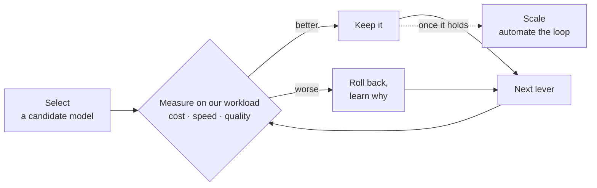

  

  <b><i>Learn what each new model does well — and where it fits in our agent.</i></b>

  

  
  
  
  

 

Building our first agent is easy. Keeping it reliable — at the right cost, speed, and quality, as new models keep shipping — is the hard part. That's the climb on our banner: **select** the right model, **optimize** it one measured step at a time, and **scale** what works through automation.

Model Releases is the first step up that hill. Every new release we cover gets a **capsule**: a hands-on notebook that shows what the model does well and how it might improve an agent we already run.

> [!IMPORTANT]
> **Coming from an old link?** We reorganized the repo in November 2026 — see [where things moved](#did-an-old-link-break).

 

## What's new?

<!-- BEGIN:LATEST -->
| Capsule | Date | What it does |
|---|---|---|
| [MAI-Transcribe-2](capsules/mai-transcribe-2/) | 2026-09-03 | Speaker diarization, word timestamps, and domain biasing for noisy multilingual audio |
| [Model Router — August 2026](capsules/model-router/) | 2026-08-19 | Routing modes, model subsets, deployment types, failover, and agentic routing as optimization levers |
| [MAI-Image-2.5 family](multi-model/mai-image-family-walkthrough/) | 2026-08-12 | Multi-model: compare MAI-Image-2.5, Flash, and Pro on identical prompts |
<!-- END:LATEST -->

Looking for an older release? Every capsule is in the [CHANGELOG](CHANGELOG.md). Don't see the model we need? [Open an issue](https://github.com/microsoft-foundry/model-releases/issues/new) — requests shape what we build next.

 

## How do I get started?

Three steps, and the first two happen only once:

1. **Open in GitHub Codespaces** with the button above — Python, the Azure CLI, and every package are already installed.
2. **Run [setup.ipynb](setup.ipynb).** It signs us in, connects or creates a Microsoft Foundry project, and writes the `.env` every capsule reads.
3. **Open a capsule and run it top to bottom.** Its first cell lists the models to deploy, and the env check names anything still missing.

 

## How do we learn the most from a capsule?

Every capsule follows the same order — **release at a glance → env check → numbered steps → Your Turn to Explore → summary** — so after one, the rest feel familiar.

Running the cells shows us what the model *can* do. Changing them shows us what it does *for us*. In **Your Turn to Explore**, we swap in our own prompts or data, predict the result, run it, and compare.

When a cell fails, we treat it as a clue:

| What we see | What it usually means | What to try |
|---|---|---|
| The env check lists missing names | A setting isn't in `.env` yet | Re-run [setup.ipynb](setup.ipynb), or add the listed variables |
| `401` / `403` | Wrong key, or our identity lacks access | Check the key in `.env` and our role on the Foundry project |
| `404` model or deployment not found | The deployment name doesn't match the portal | Match it exactly — names are case-sensitive |
| The output surprises us | The model behaves differently on our input | Change one thing, re-run, compare |

Still stuck? [Open an issue](https://github.com/microsoft-foundry/model-releases/issues/new) with the failing cell's output.

 

## New to these models? Which primer should we read first?

Each primer explains one model category in plain language — what it is, when to reach for it, when *not* to — and links to a capsule where we can try it.

| Primer | Read it when we want to… |
|---|---|
| [Chat Completion](primers/chat-completion.md) | Understand how instruction-following and dialogue models work |
| [Reasoning](primers/reasoning-models.md) | Know when an extended-thinking model is worth the extra cost |
| [Function Calling](primers/function-calling.md) | Let a model call our tools and APIs |
| [Multimodal](primers/multimodal-models.md) | Send images or audio alongside text |
| [Long Context](primers/long-context.md) | Fit whole documents or codebases into one prompt |
| [Embeddings](primers/embeddings.md) | Search and compare text by meaning |
| [Image Generation](primers/image-generation.md) | Create or edit images from a prompt |
| [Audio / Speech](primers/audio-speech.md) | Transcribe speech or generate a voice |
| [Decision Models](primers/decision-models.md) | Classify, route, gate, or score inputs with typed answers instead of prose |
| [Robotics (VLA)](primers/robotics.md) | See how vision-language-action models turn instructions into robot motion |
| [Fine-tuning](primers/fine-tuning.md) | Customize a model for our domain |
| [Model Router](primers/model-router.md) | Let one endpoint pick the right model for each request |
| [Optimization](primers/optimization.md) | Lower cost and latency without losing quality |

 

## How do capsules help an agent we already run?

A capsule is one step on the climb. We try a new model against the job our agent already does, and keep it only if the agent gets better:

```mermaid
flowchart LR
    S["Select<br/>a candidate model"] --> M{"Measure on our workload<br/>cost · speed · quality"}
    M -->|better| K["Keep it"]
    M -->|worse| R["Roll back,<br/>learn why"]
    K --> N["Next lever"]
    R --> N
    N --> M
    K -.once it holds.-> A["Scale<br/>automate the loop"]
```

- **Measure on shared data.** [Contoso Travel](datasets/contoso-travel/) gives us a fixed workload and benchmark, so comparisons are fair.
- **See the full loop in action.** The [Model Router capsule](capsules/model-router/) optimizes instructions first, then routes each request to a right-sized model.
- **Learn the vocabulary of the climb** — tokenomics, right-sizing, hill climbing — in the [Optimization primer](primers/optimization.md).

 

## What else is in this repo?

| Folder | What we'll find |
|---|---|
| [`capsules/`](capsules/) | One folder per model release |
| [`multi-model/`](multi-model/) | Scenarios that compare or combine several models on a real task |
| [`primers/`](primers/) | Beginner-friendly explainers for each model category |
| [`datasets/`](datasets/) | Fictitious business scenarios that samples share, so results are reproducible |
| [`archive/`](archive/) | Capsules for models that have been retired |

 

## Where can we go next?

- **[Model Mondays](https://aka.ms/model-mondays)** — a weekly livestream on new models in Microsoft Foundry.
- **[Model Mastery](https://aka.ms/model-mastery)** — hands-on workshops that go deeper.
- **Want to add a capsule, primer, or dataset?** [CONTRIBUTING.md](CONTRIBUTING.md) walks through it, and the GitHub Copilot skills in this repo handle most of the scaffolding.

 

## Did an old link break?

We reorganized the repo in November 2026 so capsules are faster to find:

| Old path | New path |
|---|---|
| `models/<publisher>/<model>/` | [`capsules/<model>/`](capsules/) |
| `models/model-router/aug-2026/` | [`capsules/model-router/`](capsules/model-router/) |
| `models/<publisher>/multi-model-scenarios/<name>/` | [`multi-model/<name>/`](multi-model/) |
| `models/quickstart/` | [`setup.ipynb`](setup.ipynb) |
| `docs/primers/` and `docs/GLOSSARY.md` | [`primers/`](primers/) |
| `demos/` | [`datasets/`](datasets/) |
| `CAPSULE-TOC.md`, publisher READMEs | [`CHANGELOG.md`](CHANGELOG.md) |
