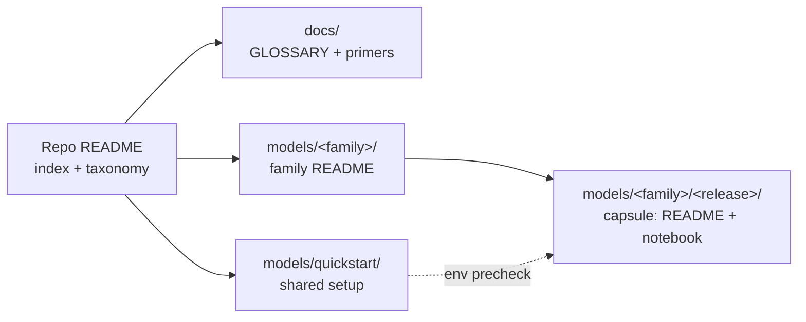
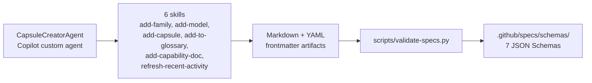

# Reference Guide

Background material for the [Microsoft Foundry Model Releases](../README.md) repo — how it's organized, what the model families and capability tags mean, and how to add content of your own.

- [Repository: What resources can I find here?](#repository-what-resources-can-i-find-here)
- [Learn About: Model families](#learn-about-model-families)
- [Learn About: Model capabilities](#learn-about-model-capabilities)
- [Contributing: How can I add new content?](#contributing-how-can-i-add-new-content)

<br/>

## Repository: What resources can I find here?

The repository is meant to be a self-contained resource where you can:
1. Learn about the latest model release announcements (via CHANGELOG)
1. Get hands-on experience with model releases (via `models/` release capsules)
1. Fill gaps in model knowledge with supporting glossary & primers (in `docs/`)

Here is a visual representation of the repository structure for reference:
- the `docs/` folder has a glossary and primers to build familiarity with terminology
- the `models/` folder contains the model release capsules, organized by provider/family.
- the `models/quickstart` folder contains guidance to get started with development.



<br/>

## Learn About: Model families

Models are typically associated with a provider (the organization that created and maintains the model) and belong to a specific _family_ within that scope. Each new release in that family can now describe the advances made (e.g., new features, improved costs or performance) that can help you make a model selection or migration decision. Here are the main model families we will track:

| Family | What it's for | README |
|---|---|---|
| Azure OpenAI | GPT-family models via Foundry | [`models/azure-openai/`](../models/azure-openai/) |
| Microsoft AI | Microsoft-built models (Phi, MAI, …) | [`models/microsoft-ai/`](../models/microsoft-ai/) |
| Anthropic | Claude family | [`models/anthropic/`](../models/anthropic/) |
| Cohere | Command + Embed models | [`models/cohere/`](../models/cohere/) |
| Mistral | Mistral / Mixtral / Ministral | [`models/mistral/`](../models/mistral/) |
| Model Router | One endpoint, routed to best-fit model | [`models/model-router/`](../models/model-router/) |
| Hugging Face | Open-source model catalog | [`models/hugging-face/`](../models/hugging-face/) |
| Fireworks | Fast OSS-model inference | [`models/fireworks/`](../models/fireworks/) |
| DeepSeek | DeepSeek reasoning + chat models | [`models/deepseek/`](../models/deepseek/) |
| xAI | Grok family | [`models/xai/`](../models/xai/) |
| Black Forest Labs | FLUX image-generation models | [`models/black-forest-labs/`](../models/black-forest-labs/) |
| NVIDIA | NIM microservices for language, vision, biology, and earth science | [`models/nvidia/`](../models/nvidia/) |

<br/>

## Learn About: Model capabilities

Every capsule is tagged with one or more of these. Names are defined
**once here** and reused everywhere (family READMEs, capsule badges,
CHANGELOG, Recently added).

| Tag | What it means | Primer |
|---|---|---|
| **Chat Completion** | General instruction-following and dialogue. | [chat-completion](primers/chat-completion.md) |
| **Reasoning** | Extended-thinking / chain-of-thought optimized models. | [reasoning-models](primers/reasoning-models.md) |
| **Multimodal** | Accepts image (and/or audio) input alongside text. | [multimodal-models](primers/multimodal-models.md) |
| **Vision** | Image understanding as a primary capability. | [multimodal-models](primers/multimodal-models.md) |
| **Image Generation** | Text → image output. | [image-generation](primers/image-generation.md) |
| **Embeddings** | Vector representations for retrieval / similarity. | [embeddings](primers/embeddings.md) |
| **Audio / Speech** | STT, TTS, or realtime voice. | [audio-speech](primers/audio-speech.md) |
| **Function Calling** | Structured tool invocation. | [function-calling](primers/function-calling.md) |
| **Model Router** | One endpoint that routes requests across models. | [model-router](primers/model-router.md) |
| **Fine-tuning Ready** | Supports customization / distillation. | [fine-tuning](primers/fine-tuning.md) |
| **Long Context** | 200k+ token context window. | [long-context](primers/long-context.md) |

Unsure what a term means? Check the [glossary](GLOSSARY.md).

<br/>

## Contributing: How can I add new content?

Want to add a new capsule, or model family, or model capability or glossary term? The repo is spec-driven - so the easiest way is to use GitHub Copilot and activate the relevant skills with a prompt. This ensures content is validated against the schema and referenced consistently across documents.



1. **Start with the [maintainer guide](../.github/maintainer-guide.md)** — it
covers setup validation, how to add your first capsule/family/term, and
the testing strategy.
1. **Activate the CapsuleCreatorAgent** to get a guided experience for content creation. Try this prompt with GitHub Copilot (or switch to the custom agent in GitHub Copilot Chat)

    ```text
    Use the CapsuleCreatorAgent to add a capsule for the (model) released on (date)
    ```
