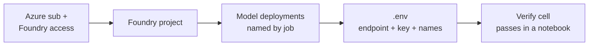

# Foundry Quickstart

> **Do this once.** Every capsule notebook in this repo assumes you've
> completed the four steps below. When a notebook can't find a required
> env var, it will point you back here.

**Grounded in Microsoft Learn:**
[Foundry quickstart docs](https://learn.microsoft.com/en-us/azure/foundry/quickstarts/get-started-code) ·
[Foundry Models overview](https://learn.microsoft.com/en-us/azure/foundry/concepts/foundry-models-overview) ·
[Model catalog](https://learn.microsoft.com/en-us/azure/foundry/concepts/foundry-models-overview)

---

## What you'll set up



---

## 1. Prerequisites

- An **Azure subscription** with access to Microsoft Foundry
  ([sign-in](https://ai.azure.com)).
- **Azure CLI** logged in: `az login` — see
  [Azure CLI docs](https://learn.microsoft.com/en-us/cli/azure/get-started-with-azure-cli).
- **Python 3.10+** (the devcontainer ships 3.12) or open this repo in the
  provided devcontainer, which installs `requirements-dev.txt` for you.

## 2. Create a Foundry project

Portal path:
[Create a project in the Foundry portal](https://learn.microsoft.com/en-us/azure/foundry/how-to/create-projects).

CLI path (helper coming to [`scripts/`](../../scripts/)):

```bash
# scripts/create-foundry-project.sh <project-name> <region>
# Placeholder — see scripts/README.md for the current inventory.
```

**Region tip.** Not every model is available in every region. Check the
[model catalog](https://learn.microsoft.com/en-us/azure/foundry/concepts/foundry-models-overview)
for the model you plan to deploy and pick a region that hosts it.

## 3. Deploy the models a capsule needs

Each release capsule lists the exact deployments it expects in its
**Before You Begin** section. Deploy them by:

1. Opening your project → **Model catalog**.
2. Selecting the model → **Deploy**.
3. Naming the deployment **by the job it does**, not the raw model name
   (e.g. `router-nano`, `policy-mini`, `planner-gpt41`). This makes it
   trivial to swap models later without touching notebooks.

See [Deploy models to Foundry](https://learn.microsoft.com/en-us/azure/foundry/how-to/deploy-models-openai).

## 4. Configure `.env`

Copy the template and fill it in:

```bash
./scripts/setenv.sh                          # copy template only
./scripts/setenv.sh <resource-group> <project-name>   # + populate via Azure CLI
```

Details in [`scripts/setenv.spec.md`](../../scripts/setenv.spec.md).

Then set at minimum:

| Variable | What it is |
|---|---|
| `AZURE_FOUNDRY_ENDPOINT` | Your project's inference endpoint URL |
| `AZURE_FOUNDRY_API_KEY` | Project API key (or use `azure-identity`) |
| `AZURE_FOUNDRY_REGION` | Region you deployed into (e.g. `swedencentral`) |
| `<JOB>_DEPLOYMENT` | One per deployment used by the capsule you're running |

Capsules add capsule-specific vars in their **Before You Begin**. The
`.env` file is git-ignored — never commit it.

## 5. Verify

Every capsule notebook opens with an **env precheck cell** that prints
✅ when your `.env` is complete and ⚠️ pointing back here when it isn't.
You can also run this one-liner from the repo root:

```bash
python -c "import os,dotenv; dotenv.load_dotenv(); \
required=['AZURE_FOUNDRY_ENDPOINT','AZURE_FOUNDRY_API_KEY']; \
missing=[v for v in required if not os.getenv(v)]; \
print('✅ base env OK' if not missing else f'⚠️ missing: {missing}')"
```

---

## Troubleshooting

- **`401 / 403`** — API key wrong, or your identity lacks the *Cognitive
  Services User* role. See
  [Foundry RBAC](https://learn.microsoft.com/en-us/azure/foundry/concepts/rbac-azure-ai-foundry).
- **`404 model not found`** — deployment name in `.env` doesn't match
  what's in the portal. Match them exactly (case-sensitive).
- **Quota errors** — request a quota increase from the portal or pick a
  smaller model to start. See
  [Manage quotas](https://learn.microsoft.com/en-us/azure/foundry/how-to/quota).
- **Region mismatch** — a model isn't available in your region; deploy
  it to the region listed in the capsule's Before You Begin.

Still stuck? Open an issue against this repo with the failing cell's
output.
